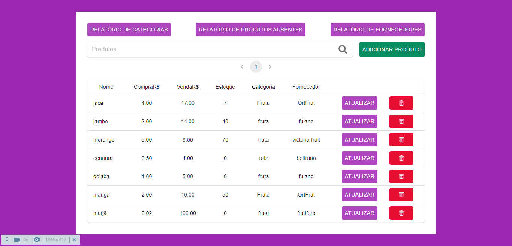
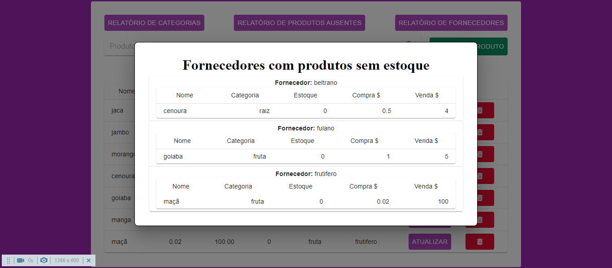

<h1 align="center">Stock-Manager-Frontend(React.js)</h1>

- Projeto de gerenciamento de estoque criado em react.js

  

  

## O que foi utilizado no projeto:
  - material-ui -> Foram utilizados alguns componentes da biblioteca(ex: tabelas, modais e etc....);
  - yup -> Utilizado para fazer validação de dados;
  - react-icons -> Utilizado para pegar icones;
  - react-hook-form -> Utilizado para criação do formulario;
  - axios -> Utilizado para solicitar requisições http;

## Rodando o projeto:

<b><h2>OBS: Antes de rodar os códigos à seguir, certifique-se que foi feito o clone do repositório e que o terminal se encontra na pasta do projeto!!</h2></b>

Instale as dependências usando:

### `yarn # or yarn install`

E para rodar o projeto utilize o código:

### `yarn start`
